 <!-- .element style="max-width:55%;" -->
# vRealize Orchestrator
## *An Automation journey*
<!-- .slide: class="centered" -->


## Présentations


**SII Ouest**

Une des agences du Groupe SII.

* *ESN* (== SSII)
* ~450 collaborateurs (6000 à l'échelle du Groupe)
* Une 15aine de profils autour des technos **VMware**
  * Centre de service (plateau) et assistance technique
  * Ingénierie et opérations
* [www.groupe-sii.com](http://www.groupe-sii.com/fr)


**Ludovic Rivallain**

Senior Virtualization & Cloud-Computing Consultant à *SII* Ouest.

* [@lrivallain](https://twitter.com/lrivallain)
* [lrivallain@sii.fr](mailto:lrivallain@sii.fr)
* [vUptime.io](https://vuptime.io/)


## Dunes, vCO, vRO


### Dunes Virtual Services Orchestrator

* **Septembre 2007**: [Rachat de *Dunes Technologies* par VMware](https://ir.vmware.com/overview/press-releases/press-release-details/2007/VMware-Acquires-Dunes-Technologies/default.aspxà):
  * Et notamment son produit: *Dunes Virtual Services Orchestrator*


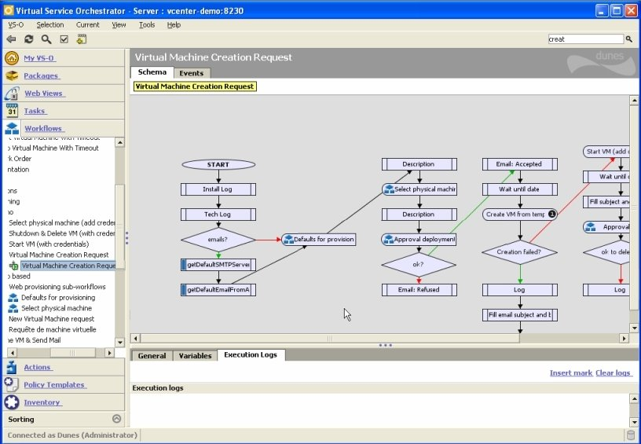<!-- .element class="centered bordered" style="width:90%;" -->


### vCenter Orchestrator

* **Avril 2009**: * **vC**enter **O**rchestrator 4.0* est distribué par VMware.


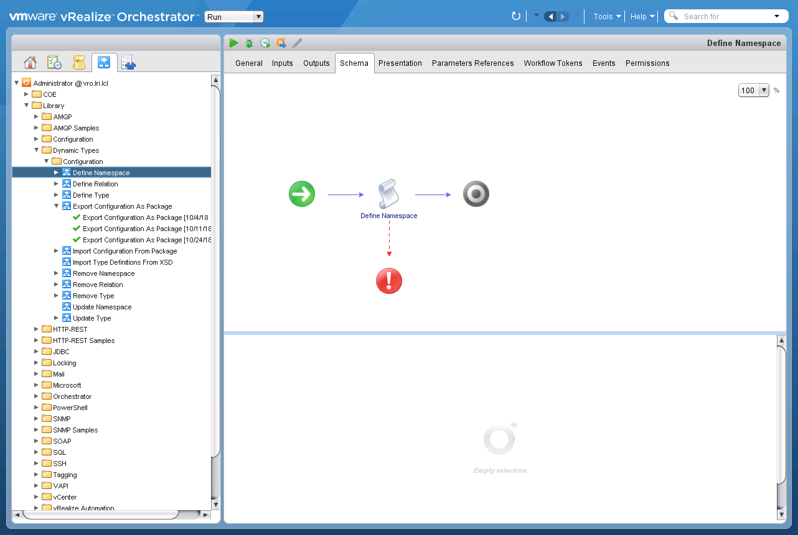


### vRealize Orchestrator

* Depuis **Mars 2015**: * **vR**ealize **O**rchestrator*
* Dernière version: vRealize Orchestrator **7.5.0**


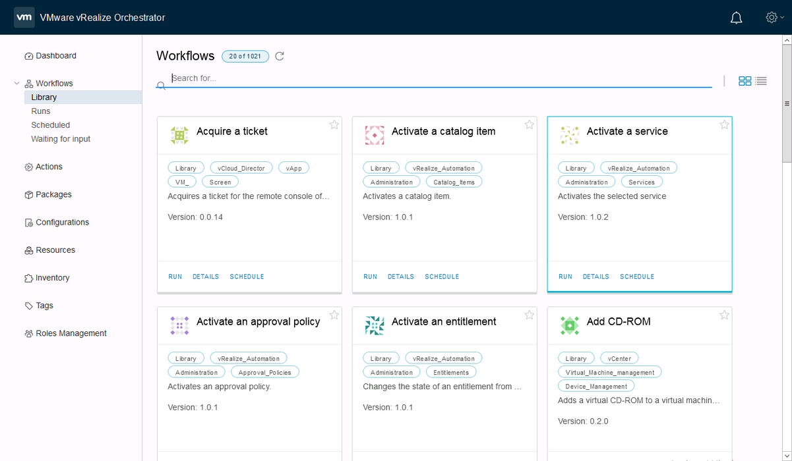<!-- .element class="centered bordered" style="width:100%;" -->


## Présentation


### Moteur de workflow

vRO est principalement un moteur de workflow:

* Librairie standard:
  * Contenu initial
  * Contenu proposé par **VMware**
* Contenus personalisés


### Workflow, quésaco ?

> Représentation d'une suite de tâches ou opérations à effectuer.

Le workflow sert à décrire:

* le circuit des traitements
* les tâches à répartir entre les différents acteurs d'un processus
* les délais
* les contrôles et les modes de validation


### Rôle d'un workflow dans nos pratiques

**Automatiser !**

Automatiser une action récurrente basée sur des données connues (*inputs*) ou calculables (à partir des *inputs*).

Eventuellement: produire un résultat exploitable de cette action (*output*).


### Actions d'un workflow

Selon les moteurs utilisés, un workflow peut utiliser différents actionneurs pour réaliser son travail:

* **Actionneurs internes**: stocker des variables, calculer des valeurs, gérer l'algorithme…
* **Actionneurs externes**: Eléments ne faisant pas partie du moteur pour exécuter une action.


### Les dessous de vRO
<!-- .slide: style="text-align:center;" -->
<!-- .element class="centered bordered" style="width:90%;" -->


### `???`

vRO est basé sur `???`

* Moteur de backend = `???`
* Frontend = applet `???`
* Il peut être étendu via des plugins en `???`


### Java !!
<!-- .slide: style="text-align:center;" -->
<!-- .element class="centered bordered" style="" -->


vRO est basé sur *Java*

* Moteur de backend = *Java*
* Frontend = applet *Java*
* Il peut être étendu via des plugins en *Java*


### Javascript
<!-- .slide: class="with_info_box" -->

vRO embarque un moteur permettant l'interprétation du *Javascript*

* Les capacités de ce moteur sont limitées

> N'espérez pas avoir des sélecteurs comme sur jQuery ou un interpréteur digne de celui de votre browser préféré.<!-- .element style="font-size:0.8em;" -->

* Permet d'accéder aux modèles de données (via des managers) définis dans les plugins (*Java*).


### Les avantages du Javascript

* Plus **simple** à appréhender que le Java
* Pas besoin de compiler le code
* Editable directement dans le client


### Le licensing de vRO
<!-- .slide: style="text-align:center;" -->


### Le licensing de vRO
<!-- .slide: class="with_info_box" -->

vRealize Orchestrator est disponible gratuitement si vous disposez déjà d'une licence valide de *vSphere/vCenter Standard* ou *vRealize Automation* (via *vRealize Suite Advanced/Enterprise*).

> Pas d'excuse!


## Les interfaces


#### Control center

Gestion de l'appliance et/ou du cluster:

* Gestion base de données
* Startup options
* Ajout de plugins
* Troubleshooting
* …


### Control center
<!-- .slide: style="text-align:center;" -->

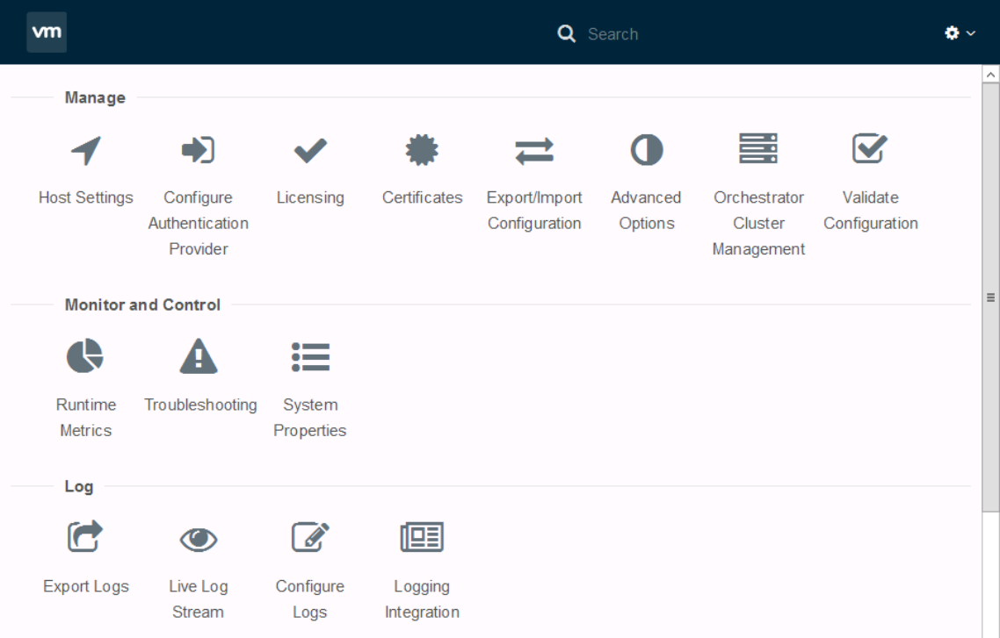<!-- .element class="centered bordered" style="width:90%;" -->


### Developper resources
<!-- .slide: style="text-align:center;" -->

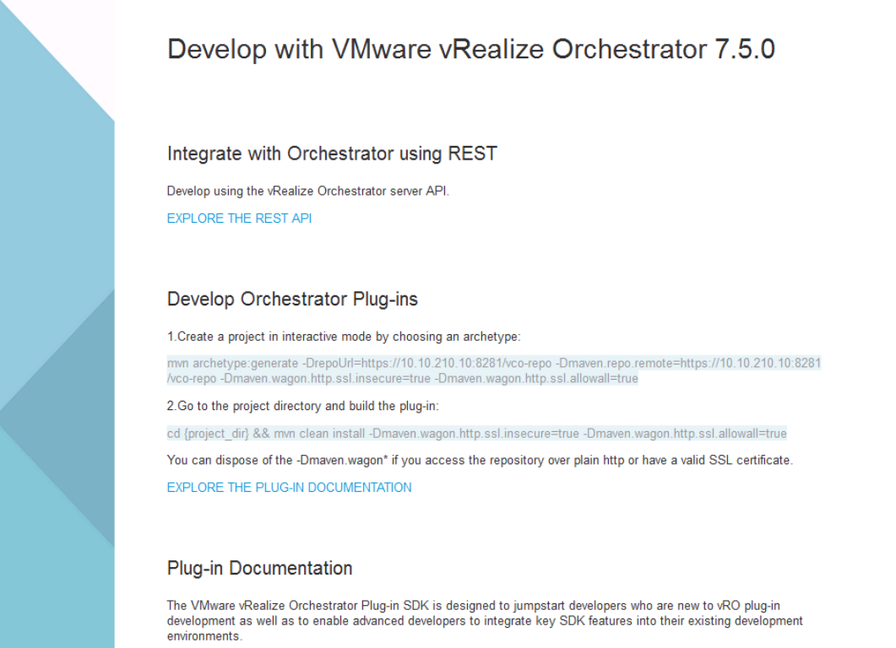<!-- .element class="centered bordered" style="width:90%;" -->


### HTML5

<!-- .element class="centered bordered" style="width:100%;" -->


### HTML5 ready
#### mais pas tout à fait encore…

* Voir
* Exécuter:
  * Run
  * Schedule
* Pas d'édition !<!-- .element style="color:#d64b13;" -->


### Client Java

Indispensable pour le moment pour l'édition des éléments.

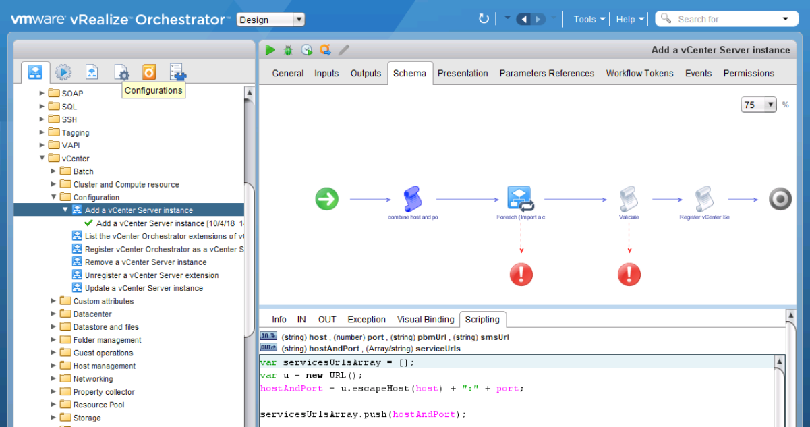<!-- .element class="centered bordered" style="width:100%;" -->


### API REST

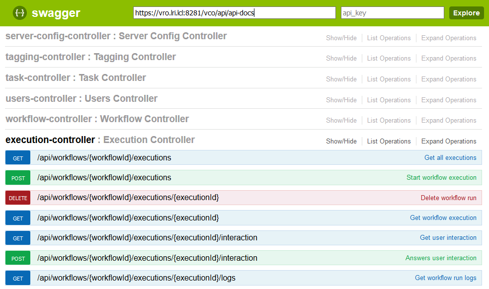<!-- .element class="centered bordered" style="width:100%;" -->


## Les objets vRO


### Plugins/Inventaire

L'inventaire de vRO permet de parcourir dynamiquement les endpoints qui y sont reliés:

* vCenter
* NSX
* AD
* BDD SQL
* …

Cela peut inclure des modèles personnalisés (via les plugins customs).


#### Exemple inventaire vCenter

<!-- .slide: style="text-align:center;" -->
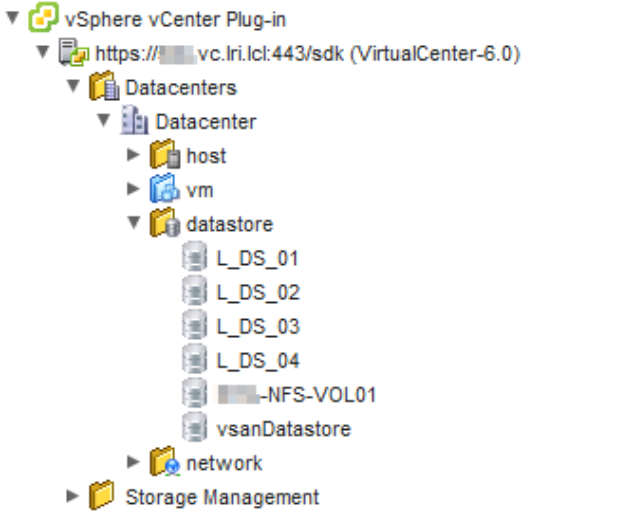<!-- .element class="centered bordered" style="width:50%;" -->


### Workflows

Scénario exécutable basé sur des:

* `input`
* `attributes` (variables)
* Tests et éléments d'algorithme
* Actionneurs


#### Exemple de workflow

<!-- .slide: style="text-align:center;" -->
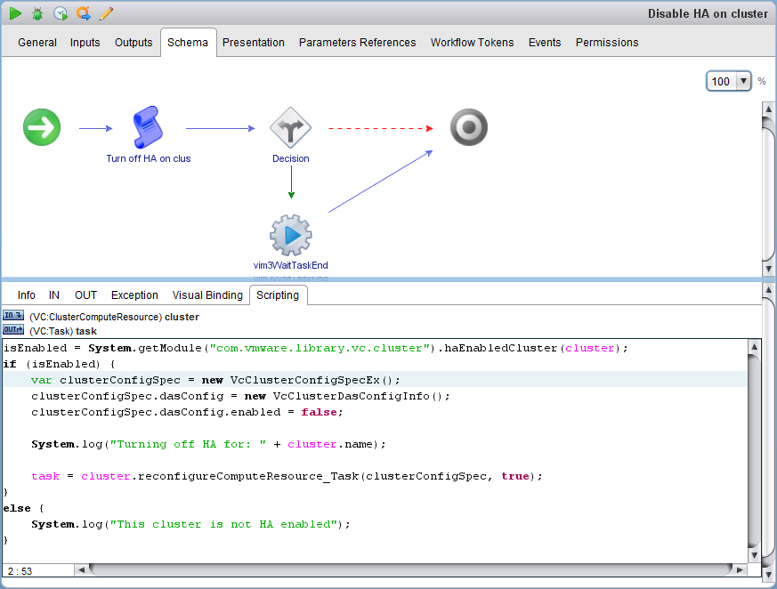<!-- .element class="centered bordered" style="width:80%;" -->


### Actions

Equivalent d'une *fonction* Javascript:

* **Réutilisable** (WF, autre action etc.)
* Des `input`
* Une `output` optionnelle

Les actions sont organisée dans des *modules*. 

Ex:

```js
isHaEnabled = System.getModule("com.vmware.library.vc.cluster")
                .haEnabledCluster(cluster);
```


#### Conseils

> Les actions c'est bon, mangez-en !

<!-- .element class="centered bordered" -->

Prévoyez des actions **génériques**:

* Facilement réutilisables
* Configurables via les `inputs`
* De**s** module**s** par thème d'actionneurs


#### Exemples de modules

* Module `com.sii.vcenter.sso_management.get`
  * Action `read_sso_configuration`
  * Action `list_sso_identity_sources`
  * Action `list_local_users`
* Module `com.sii.vcenter.sso_management.add`
  * Action `push_init_sso_configuration`
  * Action `add_sso_identity_sources`
  * Action `add_local_users`
* Module `com.sii.vcenter.sso_management.del`
  * Action `del_sso_identity_sources`
  * Action `del_local_users`


### Configurations Elements
<!-- .slide: class="with_info_box" -->

Liste d'attributs permettant de définir des constantes.

> Bref c'est un fichier de configuration quoi !

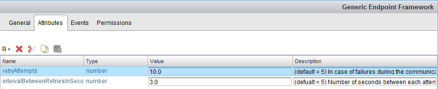<!-- .element class="centered bordered" -->


### Resource Elements

Ressources diverses pouvant être utilisées dans le contexte d'un autre élément vRO:

* Fichiers de référence (qui n'évolue pas souvent)
* Images
* Templates XML ou HTML
* Scripts
* Certificats d'autorités
* …

Taille des fichiers limitée à *16MB*.


### Schedulers
<!-- .slide: style="text-align:center;" -->

*Comme partout dans le monde IT*: Exécuter des tâches selon une programmation temporelle.

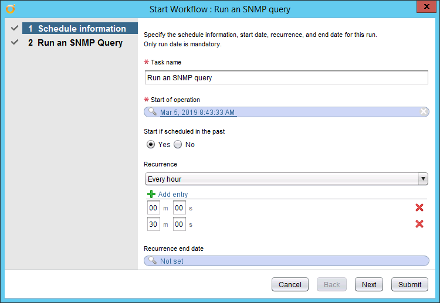<!-- .element class="centered bordered" -->


### Policies

Déclenchement d'action(s) (workflow) selon des évènements.

De base, les évènements suivants sont disponibles:

* SNMP
* AMQP
* Vérification périodique
* Autre *policy* (début et fin)


### Packages

Un package permet la distribution d'éléments de contenu de vRO:

* Workflows
* Actions
* Template de Policies
* Configurations et Resources Elements


### Packages

Un  package peut être:
* Exporté
* (Ré-)importé
* Sauvegardé
* Synchronisé…

Il permet aussi de détecter et inclure les **dépendances** entres éléments.


## Uses-cases
<!-- .slide: style="text-align:center;" -->
<!-- .element class="centered bordered" style="width:70%;" -->


### Disclaimer

Les *uses-cases* suivants s'appuient sur quelques longues années d'utilisation de vCO/vRO chez nos clients.

Ils expriment un certain *biais* lié à notre activité d'*ESN* mais permettent d'avoir une idée des capacités de cet outil.

La principale limite de vRO: votre imagination.


### On-boarding

Automatiser l'arrivée d'un nouveau client/service/utilisateur dans votre SI:

* Création des comptes AD, *Unix
* Création des accès à des services non-*AD friendly*
* Création des accès à des services externes (merci le *cloud* !)
* Routines internes…


### Migration(s)

Exporter la structure d'une organisation **vCloud Director** afin de la réimporter dans un autre déploiement.

Dans le use-case d'un de nos clients, Zerto n'était absolument pas performant sur ce travail et un contournement basé sur vRO a été développé (gain de temps: `~x10`).


### Extension de fonctionnalités
#### Blocking tasks

La notion de *Blocking tasks* sur **vCloud Director** permet d'intervenir avant/pendant/après le déploiement d'une resource.

En utilisant vRO+AMQP (RabbitMQ), on peut par exemple:

* Renseigner un outil de gestion de parc.
* Demander le monitoring, le backup de la ressource.
* Insérer un mécanisme d'approbation des demandes…


### Extension de fonctionnalités
#### Multi-cloud

**vRealize Automation** s'appuie sur vRO pour étendre le champ de ses fonctionnalités (*XaaS*).

Cela nous a permis d'ajouter le support d'un cloud public initialement non pris en charge par vRA.

Ce projet utilisait massivement les `dynamicTypes` et les call API *REST* via le plugin natif de vRO afin de permettre le déploiement de stack *HEAT* (OpenStack).


### Interconnexions de produits

Interaction avec des équipements réseaux pour provisionner des environnements clients automatiquement (*le SDN avant l'heure!*):

* Partition F5/BigIP
* VSYS Juniper
* VRF Cisco…


## Conclusion & questions

Les slides de la présentation:

[groupe-sii.github.io/rex-vro-meetngeek](https://groupe-sii.github.io/rex-vro-meetngeek/)


### ⚽ Petit point sur le match ⚽
<!-- .slide: style="text-align:center;" -->

<div class = "stretch">
    <iframe width="100%" height="100%" src="https://fr.uefa.com/uefaeuropaleague/season=2019/matches/round=2000992/match=2026907/index.html?iv=true"></iframe>
</div>


## Merci !